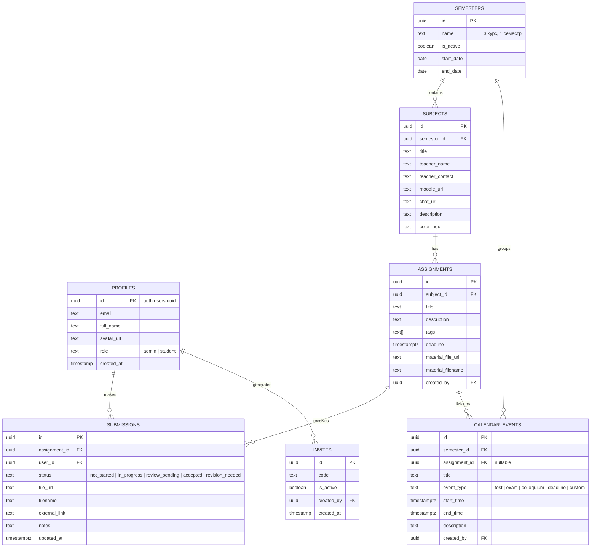

# 🎓 StudyOS — Персональный академический хаб учебной группы

> **StudyOS** — это легковесный, круглосуточно доступный веб-сервис для совместного трекинга учебного процесса мини-группы студентов (до 5 человек). Платформа централизует семестры, предметы, методички, лабораторные работы, дедлайны, файлы выполненных решений и календарь важных событий.

---

## 📌 Содержание
1. [Суть и цели проекта](#-суть-и-цели-проекта)
2. [Архитектура и хостинг (0 ₽ / 24/7)](#-архитектура-и-хостинг-0---247)
3. [Ролевая модель и доступ](#-ролевая-модель-и-доступ)
4. [Функциональные модули системы](#-функциональные-модули-системы)
5. [Схема базы данных (PostgreSQL / Supabase)](#-схема-базы-данных-postgresql--supabase)
6. [Технологический стек](#-технологический-стек)
7. [Пошаговый план реализации (Roadmap)](#-пошаговый-план-реализации-roadmap)
8. [Инструкция по развертыванию (Quickstart)](#-инструкция-по-развертыванию-quickstart)
9. [SQL-скрипт инициализации базы данных](#-sql-скрипт-инициализации-базы-данных)

---

## 🎯 Суть и цели проекта

Во время учебы в университете студенты сталкиваются с хаосом: методички разбросаны по чатам Telegram, дедлайны забываются, нет единого понимания, кто какую лабораторную уже закрыл и у кого можно подсмотреть или взять за основу решение.

**StudyOS решает эти боли:**
* **Всё в одном месте:** в начале семестра староста/админ заносит дисциплины, загружает методички и выставляет дедлайны.
* **Свободный обмен решениями:** каждый участник прикрепляет свой отчет/код/архив, а сокурсники могут в 1 клик скачать его и ознакомиться.
* **Матрица прогресса группы:** наглядная сводная таблица, где сразу видно прогресс всех 5 участников по всем работам.
* **Умный календарь событий:** автоматические даты сдачи лабораторных + ручные события (тесты, коллоквиумы, экзамены, зачеты).
* **Полная доступность 24/7:** работает на надежной бесплатной облачной инфраструктуре с любого устройства (ПК, планшет, смартфон).

---

## ☁️ Архитектура и хостинг (0 ₽ / 24/7)

Система оптимизирована для работы на бесплатных тарифах без необходимости держать включенный домашний ПК:

```
┌────────────────────────────────────────────────────────┐
│                   Клиент (Браузер / Телефон)           │
└───────────────────────────┬────────────────────────────┘
                            │ HTTPS
                            ▼
┌────────────────────────────────────────────────────────┐
│  Vercel (Hobby Tier — Бесплатно)                       │
│  • Next.js 14+ App Router (SSR, Server Actions, UI)    │
│  • Глобальный CDN + SSL сертификат                     │
│  • Круглосуточная доступность (99.99% Uptime)          │
└───────────────────────────┬────────────────────────────┘
                            │ API / SDK
                            ▼
┌────────────────────────────────────────────────────────┐
│  Supabase (Free Tier — Бесплатно)                      │
│  • PostgreSQL Database (до 500 МБ)                     │
│  • Supabase Auth (Сессии, JWT, Invite-коды)            │
│  • Supabase Storage (1 ГБ под методички и архивы лаб)  │
│  • Row Level Security (RLS) — изоляция данных          │
└────────────────────────────────────────────────────────┘
```

### Анализ лимитов бесплатного хостинга для 5 пользователей:
| Ресурс | Бесплатный лимит Supabase / Vercel | Реальная потребность на 5 человек | Статус |
| :--- | :--- | :--- | :--- |
| **Хранилище файлов** | 1000 МБ (Supabase Storage) | ~200–400 МБ за семестр | ✅ Хватит с запасом |
| **База данных** | 500 МБ (PostgreSQL) | < 10 МБ текста | ✅ Сверхзапаса |
| **Трафик фронтенда** | 100 ГБ / месяц (Vercel) | < 3 ГБ / месяц | ✅ Сверхзапаса |
| **Пользователи Auth**| 50 000 MAU | 5 человек | ✅ Сверхзапаса |

> **Предотвращение сна Supabase:**  
> Бесплатные проекты Supabase приостанавливаются при отсутствии активности в течение 7 дней. В StudyOS это решается простым бесплатным пингом раз в 4 дня через **GitHub Actions** или **Vercel Cron Jobs**.

---

## 👥 Ролевая модель и доступ

### 1. Закрытый контур безопасности
* В открытом интернете регистрация заблокирована от случайных посетителей.
* Доступ осуществляется **только по персональному инвайт-коду** или **прямой ссылке-приглашению**, сгенерированной администратором.

### 2. Роли участников
* **Администратор (`admin`):**
  * Создание и архивация семестров.
  * Добавление/редактирование предметов, ссылок на Moodle/беседы и контактов преподавателей.
  * Создание лабораторных работ, загрузка оригинальных методичек и файлов заданий, установка тегов и дедлайнов.
  * Создание общегрупповых событий в календаре (тесты, коллоквиумы, консультации, экзамены).
  * Управление инвайтами и возможность назначить роль `admin` любому участнику группы.
* **Студент (`student`):**
  * Просмотр предметов, методичек, дедлайнов и календаря.
  * Персональный трекинг статуса по каждой лабораторной работе.
  * Загрузка выполненных файлов решений (архивы, PDF, DOCX, код) и указание ссылок на GitHub/диски.
  * Просмотр и скачивание решений других участников группы для взаимопомощи.

---

## 📦 Функциональные модули системы

### 1. Главный экран (Dashboard)
* **Горящие дедлайны:** список задач текущего студента, у которых приближается срок сдачи (сортировка: просроченные $\rightarrow$ сегодня $\rightarrow$ ближайшие 3 дня $\rightarrow$ неделя).
* **Сводная матрица прогресса группы:** таблица «Студенты $\times$ Лабораторные» по выбранному предмету:
  * Зеленый бейдж — Сдано/Зачтено
  * Синий — На проверке у преподавателя
  * Желтый — В процессе выполнения
  * Красный — На доработке / Горит дедлайн
  * Серый — Не начато
* **Быстрый виджет календаря** на текущую неделю.

### 2. Каталог семестров и предметов
* Переключатель активного семестра («3 курс, 1 семестр», «3 курс, 2 семестр», архив).
* Карточка предмета:
  * Название и цветовой акцент (для быстрой идентификации в календаре).
  * Преподаватель (ФИО, контакты, Telegram, почта).
  * Полезные ссылки: курс в Moodle, беседа группы, диск с лекциями.
  * Сводная статистика сдачи по предмету (например, *«Сдано 4 из 8 лаб»*).

### 3. Страница лабораторной работы (Lab Page)
* **Блок задания:**
  * Заголовок, подробное описание/требования, теги (тип: `Лабораторная`, `Курсовая`, `РГР`; тема: `PostgreSQL`, `React`, `Алгоритмы`).
  * Дедлайн с обратным отсчетом таймера.
  * Прикрепленная методичка / файл условия (кнопка прямого скачивания).
* **Блок личного статуса студента:**
  * Переключатель статуса:
    1. ⚪ *Не начато*
    2. 🟡 *В процессе*
    3. 🔵 *Ждет проверки преподом*
    4. 🟢 *Зачтено / Сдано*
    5. 🔴 *На доработке*
  * Форма сдачи:
    * Загрузка файла решения (до 50 МБ: `.zip`, `.pdf`, `.docx`, `.rar`, `.py`, `.cpp` и т.д.).
    * Опциональное поле: ссылка на репозиторий GitHub или Google Drive.
    * Комментарий / заметка к сдаче.
    * Возможность перезалить новую версию при доработке.
* **Блок «Решения группы»:**
  * Список сокурсников, сдавших работу.
  * Дата и время загрузки.
  * Ссылка на скачивание файла и ссылка на репозиторий.

### 4. Интерактивный академический календарь
* Режимы отображения: **Месяц** и **Неделя**.
* **Типы событий:**
  * 🔴 **Дедлайн лабораторной** (генерируется автоматически на основе даты сдачи лабы, подсвечивается личным статусом студента).
  * 🟣 **Контрольная работа / Тест** (добавляется админом).
  * 🟠 **Коллоквиум / Защита** (добавляется админом).
  * 🔵 **Экзамен / Зачет** (добавляется админом).
  * 🟢 **Консультация / Прочее** (добавляется админом).
* Быстрый клик по событию открывает карточку с деталями или прямую ссылку на страницу соответствующей лабораторной.

### 5. Управление доступом (Админ-панель)
* Генерация разовых или многоразовых инвайт-ссылок / кодов.
* Список зарегистрированных пользователей группы (5 аккаунтов).
* Кнопка переключения прав (назначить/снять права `admin`).

---

## 🗄️ Схема базы данных (PostgreSQL / Supabase)

### Диаграмма связей сущностей (ERD)



---

## 🛠️ Технологический стек

* **Frontend & Fullstack Framework:** [Next.js 14+](https://nextjs.org/) (App Router, React Server Components, TypeScript).
* **Стилизация и UI-компоненты:** [Tailwind CSS](https://tailwindcss.com/) + [shadcn/ui](https://ui.shadcn.com/) (Radix UI примитивы: модалки, селекты, бейджи, таблицы, дропдауны).
* **Календарь:** `@fullcalendar/react` или кастомная легковесная сетка на базе `date-fns`.
* **Иконки:** `lucide-react`.
* **Backend, База данных и Хранилище:**
  * **[Supabase](https://supabase.com/):**
    * Managed PostgreSQL (хранение всех реляционных данных).
    * Supabase Auth (сессии, регистрация, токены).
    * Supabase Storage (бакеты `materials` под методички и `submissions` под решения).
    * Row Level Security (RLS) для защиты данных от посторонних.
* **Хостинг:** [Vercel](https://vercel.com/) (бесплатный тариф Hobby, автодеплой из Git).

---

## 🚀 Пошаговый план реализации (Roadmap)

### Этап 1: Инициализация и окружение
- [ ] Создать проект в Supabase, настроить бакеты хранилища `materials` и `submissions`.
- [ ] Применить SQL-скрипт инициализации таблиц и RLS-политик.
- [ ] Инициализировать репозиторий Next.js с TypeScript, Tailwind CSS и shadcn/ui.
- [ ] Настроить Supabase Client и Middleware для сессий.

### Этап 2: Авторизация и доступ по инвайтам
- [ ] Экран входа (`/login`) и регистрации по инвайт-коду (`/register?invite=CODE`).
- [ ] Проверка инвайт-кода в базе данных перед созданием профиля.
- [ ] Разделение прав на уровне интерфейса (показ кнопок редактирования только для роли `admin`).

### Этап 3: Менеджмент семестров и предметов
- [ ] Экран со списком предметов текущего семестра и переключатель архива.
- [ ] Модальное окно создания/редактирования предмета (для админа): ввод контактов препода, ссылок на Moodle и выбора цвета.
- [ ] Карточка предмета с прогресс-баром закрытия лаб.

### Этап 4: Лабораторные работы и загрузка файлов
- [ ] Форма добавления лабораторной работы: название, описание, теги, дедлайн, загрузка методички в Supabase Storage.
- [ ] Страница лабораторной работы:
  * Просмотр и скачивание оригинального файла методички.
  * Блок изменения личного статуса (5 состояний).
  * Форма прикрепления решения (загрузка файла + ссылка на GitHub).
  * Блок решений сокурсников с кнопками скачивания и датой загрузки.

### Этап 5: Сводная матрица прогресса и Дашборд
- [ ] Компонент таблицы «Матрица группы» на главной:
  * Строки — студенты группы (5 человек).
  * Столбцы — лабораторные работы.
  * Ячейки — кликабельные цветные бейджи статусов.
- [ ] Виджет горящих дедлайнов (сортировка по срочности).

### Этап 6: Интерактивный календарь
- [ ] Интеграция календарной сетки с событиями текущего месяца.
- [ ] Автоматическое отображение дедлайнов всех лабораторных текущего семестра.
- [ ] Форма создания админом ручных событий (тесты, коллоквиумы, экзамены).
- [ ] Цветовая дифференциация типов событий.

### Этап 7: Развертывание и передача в эксплуатацию
- [ ] Подключение GitHub-репозитория к Vercel, настройка Environment Variables.
- [ ] Настройка cron-пинга для предотвращения засыпания бесплатного Supabase.
- [ ] Генерация первых инвайт-кодов для 5 сокурсников.

---

## ⚡ Инструкция по развертыванию (Quickstart)

### 1. Клонирование и установка зависимостей
```bash
git clone <URL_ВАШЕГО_РЕПОЗИТОРИЯ>
cd studyOS
npm install
```

### 2. Настройка переменных окружения
Создайте файл `.env.local` в корне проекта:
```env
NEXT_PUBLIC_SUPABASE_URL=https://your-project.supabase.co
NEXT_PUBLIC_SUPABASE_ANON_KEY=your-anon-key
SUPABASE_SERVICE_ROLE_KEY=your-service-role-key
```

### 3. Настройка Supabase
1. Создайте бесплатный проект на [supabase.com](https://supabase.com).
2. Перейдите в **SQL Editor** и выполните SQL-скрипт из раздела ниже.
3. В разделе **Storage** создайте два публичных бакета:
   * `materials` (для методичек и файлов заданий).
   * `submissions` (для выполненных работ студентов).
4. Установите лимит размера файла: до 50 МБ.

### 4. Локальный запуск
```bash
npm run dev
```
Откройте [http://localhost:3000](http://localhost:3000) в браузере.

### 5. Деплой на Vercel
1. Загрузите код в репозиторий GitHub.
2. В дашборде [Vercel](https://vercel.com) нажмите **Add New Project** $\rightarrow$ импортируйте репозиторий.
3. Добавьте переменные окружения `NEXT_PUBLIC_SUPABASE_URL` и `NEXT_PUBLIC_SUPABASE_ANON_KEY`.
4. Нажмите **Deploy**. Сервис готов к работе 24/7.

---

## 💾 SQL-скрипт инициализации базы данных

Выполните этот скрипт в **SQL Editor** в консоли Supabase:

```sql
-- 1. Перечисления (Enums)
CREATE TYPE user_role AS ENUM ('admin', 'student');
CREATE TYPE lab_status AS ENUM ('not_started', 'in_progress', 'review_pending', 'accepted', 'revision_needed');
CREATE TYPE event_type AS ENUM ('deadline', 'test', 'colloquium', 'exam', 'consultation', 'other');

-- 2. Таблица профилей пользователей
CREATE TABLE public.profiles (
    id UUID REFERENCES auth.users ON DELETE CASCADE PRIMARY KEY,
    email TEXT NOT NULL,
    full_name TEXT NOT NULL,
    avatar_url TEXT,
    role user_role DEFAULT 'student',
    created_at TIMESTAMPTZ DEFAULT TIMEZONE('utc', NOW())
);

-- 3. Таблица инвайт-кодов для регистрации
CREATE TABLE public.invites (
    id UUID DEFAULT gen_random_uuid() PRIMARY KEY,
    code TEXT UNIQUE NOT NULL,
    is_active BOOLEAN DEFAULT TRUE,
    created_by UUID REFERENCES public.profiles(id),
    created_at TIMESTAMPTZ DEFAULT TIMEZONE('utc', NOW())
);

-- 4. Таблица семестров
CREATE TABLE public.semesters (
    id UUID DEFAULT gen_random_uuid() PRIMARY KEY,
    name TEXT NOT NULL, -- e.g. "3 курс, 1 семестр"
    is_active BOOLEAN DEFAULT TRUE,
    start_date DATE,
    end_date DATE,
    created_at TIMESTAMPTZ DEFAULT TIMEZONE('utc', NOW())
);

-- 5. Таблица предметов
CREATE TABLE public.subjects (
    id UUID DEFAULT gen_random_uuid() PRIMARY KEY,
    semester_id UUID REFERENCES public.semesters(id) ON DELETE CASCADE NOT NULL,
    title TEXT NOT NULL,
    teacher_name TEXT,
    teacher_contact TEXT,
    moodle_url TEXT,
    chat_url TEXT,
    description TEXT,
    color_hex TEXT DEFAULT '#3b82f6',
    created_at TIMESTAMPTZ DEFAULT TIMEZONE('utc', NOW())
);

-- 6. Таблица заданий и лабораторных работ
CREATE TABLE public.assignments (
    id UUID DEFAULT gen_random_uuid() PRIMARY KEY,
    subject_id UUID REFERENCES public.subjects(id) ON DELETE CASCADE NOT NULL,
    title TEXT NOT NULL,
    description TEXT,
    tags TEXT[] DEFAULT '{}',
    deadline TIMESTAMPTZ,
    material_file_url TEXT,
    material_filename TEXT,
    created_by UUID REFERENCES public.profiles(id),
    created_at TIMESTAMPTZ DEFAULT TIMEZONE('utc', NOW())
);

-- 7. Таблица сданных работ и статусов студентов
CREATE TABLE public.submissions (
    id UUID DEFAULT gen_random_uuid() PRIMARY KEY,
    assignment_id UUID REFERENCES public.assignments(id) ON DELETE CASCADE NOT NULL,
    user_id UUID REFERENCES public.profiles(id) ON DELETE CASCADE NOT NULL,
    status lab_status DEFAULT 'not_started',
    file_url TEXT,
    filename TEXT,
    external_link TEXT,
    notes TEXT,
    updated_at TIMESTAMPTZ DEFAULT TIMEZONE('utc', NOW()),
    UNIQUE(assignment_id, user_id)
);

-- 8. Таблица событий календаря
CREATE TABLE public.calendar_events (
    id UUID DEFAULT gen_random_uuid() PRIMARY KEY,
    semester_id UUID REFERENCES public.semesters(id) ON DELETE CASCADE NOT NULL,
    assignment_id UUID REFERENCES public.assignments(id) ON DELETE CASCADE,
    title TEXT NOT NULL,
    event_type event_type DEFAULT 'other',
    start_time TIMESTAMPTZ NOT NULL,
    end_time TIMESTAMPTZ,
    description TEXT,
    created_by UUID REFERENCES public.profiles(id),
    created_at TIMESTAMPTZ DEFAULT TIMEZONE('utc', NOW())
);

-- 9. Включение Row Level Security (RLS)
ALTER TABLE public.profiles ENABLE ROW LEVEL SECURITY;
ALTER TABLE public.invites ENABLE ROW LEVEL SECURITY;
ALTER TABLE public.semesters ENABLE ROW LEVEL SECURITY;
ALTER TABLE public.subjects ENABLE ROW LEVEL SECURITY;
ALTER TABLE public.assignments ENABLE ROW LEVEL SECURITY;
ALTER TABLE public.submissions ENABLE ROW LEVEL SECURITY;
ALTER TABLE public.calendar_events ENABLE ROW LEVEL SECURITY;

-- 10. Базовые политики RLS (чтение для всех авторизованных участников группы)
CREATE POLICY "Авторизованные могут читать профили" ON public.profiles FOR SELECT TO authenticated USING (true);
CREATE POLICY "Пользователь может редактировать свой профиль" ON public.profiles FOR UPDATE TO authenticated USING (auth.uid() = id);

CREATE POLICY "Все авторизованные могут читать семестры" ON public.semesters FOR SELECT TO authenticated USING (true);
CREATE POLICY "Админы могут управлять семестрами" ON public.semesters FOR ALL TO authenticated USING (
    EXISTS (SELECT 1 FROM public.profiles WHERE id = auth.uid() AND role = 'admin')
);

CREATE POLICY "Все авторизованные могут читать предметы" ON public.subjects FOR SELECT TO authenticated USING (true);
CREATE POLICY "Админы могут управлять предметами" ON public.subjects FOR ALL TO authenticated USING (
    EXISTS (SELECT 1 FROM public.profiles WHERE id = auth.uid() AND role = 'admin')
);

CREATE POLICY "Все авторизованные могут читать задания" ON public.assignments FOR SELECT TO authenticated USING (true);
CREATE POLICY "Админы могут управлять заданиями" ON public.assignments FOR ALL TO authenticated USING (
    EXISTS (SELECT 1 FROM public.profiles WHERE id = auth.uid() AND role = 'admin')
);

CREATE POLICY "Все видят решения сокурсников (свободный обмен)" ON public.submissions FOR SELECT TO authenticated USING (true);
CREATE POLICY "Студент управляет своим решением и статусом" ON public.submissions FOR ALL TO authenticated USING (auth.uid() = user_id);

CREATE POLICY "Все видят события календаря" ON public.calendar_events FOR SELECT TO authenticated USING (true);
CREATE POLICY "Админы могут управлять событиями календаря" ON public.calendar_events FOR ALL TO authenticated USING (
    EXISTS (SELECT 1 FROM public.profiles WHERE id = auth.uid() AND role = 'admin')
);

-- Триггер автоматического создания профиля после регистрации через Supabase Auth
CREATE OR REPLACE FUNCTION public.handle_new_user()
RETURNS TRIGGER AS $$
BEGIN
    INSERT INTO public.profiles (id, email, full_name, role)
    VALUES (
        NEW.id,
        NEW.email,
        COALESCE(NEW.raw_user_meta_data->>'full_name', 'Студент'),
        COALESCE((NEW.raw_user_meta_data->>'role')::user_role, 'student')
    );
    RETURN NEW;
END;
$$ LANGUAGE plpgsql SECURITY DEFINER;

CREATE TRIGGER on_auth_user_created
    AFTER INSERT ON auth.users
    FOR EACH ROW EXECUTE FUNCTION public.handle_new_user();
```
